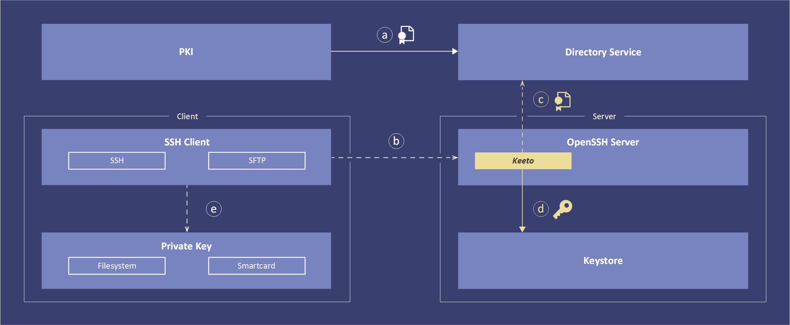

Concept
=======

The diagram shows a Keeto end to end flow. Each interaction is explained
in the following. Note that flow **(a)** is periodically and all others
are run on each SSH connection attempt.

**(a)** A Public Key Infrastructure (PKI) is responsible for managing
the whole lifecycle of X.509 certificates. This managed X.509 certificates
are distributed to a Directory Service where they can be used by Keeto.

**(b)** The SSH connection is triggered by a SSH protocol aware client
such as PuTTY, FileZilla or WinSCP. An OpenSSH server receives the
connection attempt.

**(c)** The control flow is passed over to Keeto which establishes a
connection to the Directory Service and determines the current access
permissions and retrieves relevant X.509 certificates for that connection.

**(d)** Keeto validates the X.509 certificates, extracts and transforms
public keys and writes them to the appropriate authorized_keys file.

OpenSSH public key authentication is now taking over to authenticate
the client against the freshly synced keys.

**(e)** The SSH client authenticates with the private key corresponding
to the users X.509 certificate. Depending on the security requirements
the private key can be held in software or hardware.

